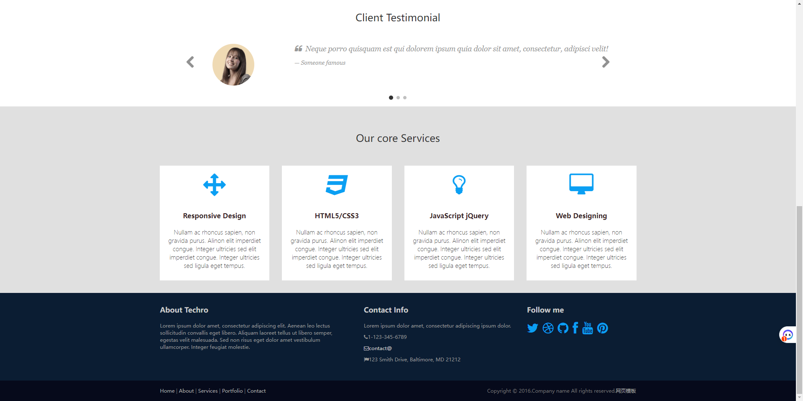
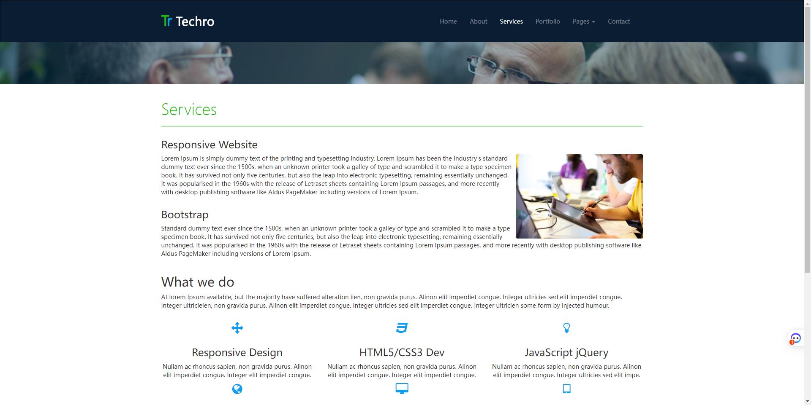
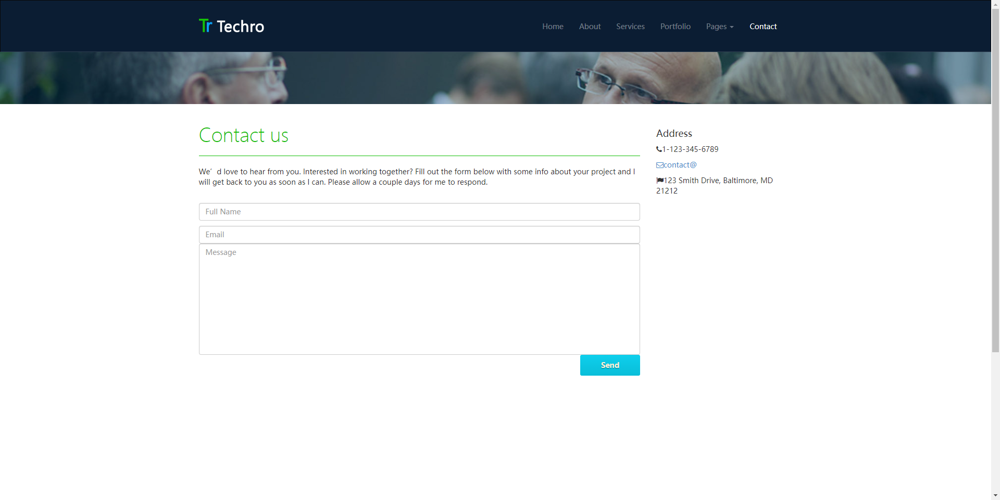

# 响应式网站模板-商务交流平台HTML5网站模板

#### 介绍
前端：HTML5+CSS3+JQUERY+BOOTSTRAP的技术架构，整站全响应式，支持移动端、PC端作为毕设作业，公司网站都非常合适。

#### 软件架构
前端：HTML5+CSS3+JQUERY+BOOTSTRAP  

#### 功能结构
首页展示：

△关于页面

△服务页面

△空间页面

△联系我们页面

#### 使用说明
1. 下载代码，双击html即可运行
 

#### 项目预览
地址：[商品详情](https://www.xunmaw.com/shop/detail/1603696541676892162)
点击演示地址 

#### 联系作者
这是作者的微信二维码，如需本项目源代码，可扫码联系联系作者  

这是作者的公众号二维码，是不是会推一些新开发的项目源码与高效软件工具，感兴趣的朋友给个关注  

